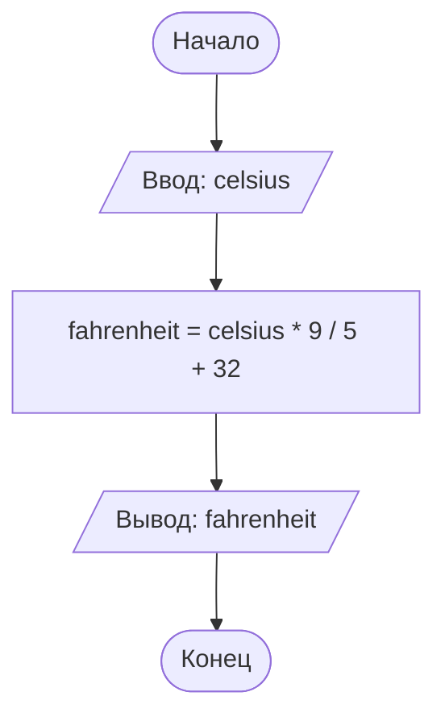

## Задача B04:

    Пользователь вводит температуру в Цельсиях.
    Переведи в Фаренгейты (F = C * 9/5 + 32) и выведи.
    Нарисуй схему алгоритма в mermaid

```mermaid
flowchart TD
    A([Начало]) --> B[/Ввод: celsius/]
    B --> C["fahrenheit = celsius * 9 / 5 + 32"]
    C --> D[/Вывод: fahrenheit/]
    D --> E([Конец])
```
