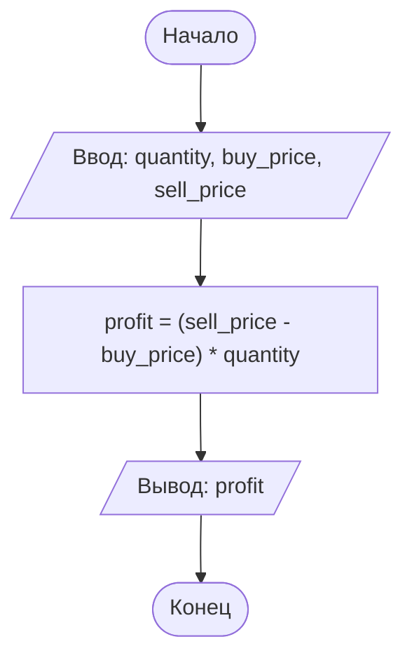

## Задача С3:

    Пользователь вводит количество акций и цену.
    Выведи прибыль, если известна цена покупки и цена продажи.

```mermaid
flowchart TD
    A([Начало]) --> B[/Ввод: quantity, buy_price, sell_price/]
    B --> C["profit = (sell_price - buy_price) * quantity"]
    C --> D[/Вывод: profit/]
    D --> E([Конец])
```
